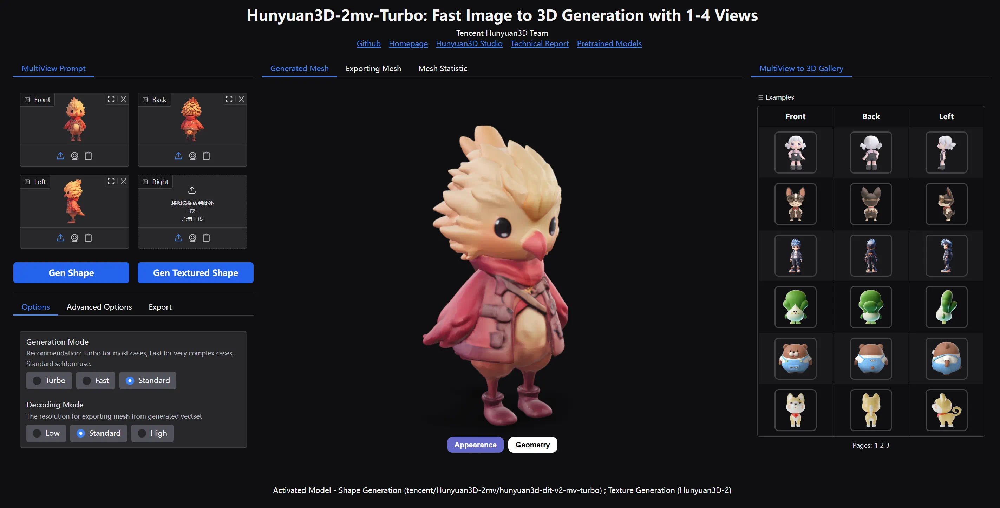
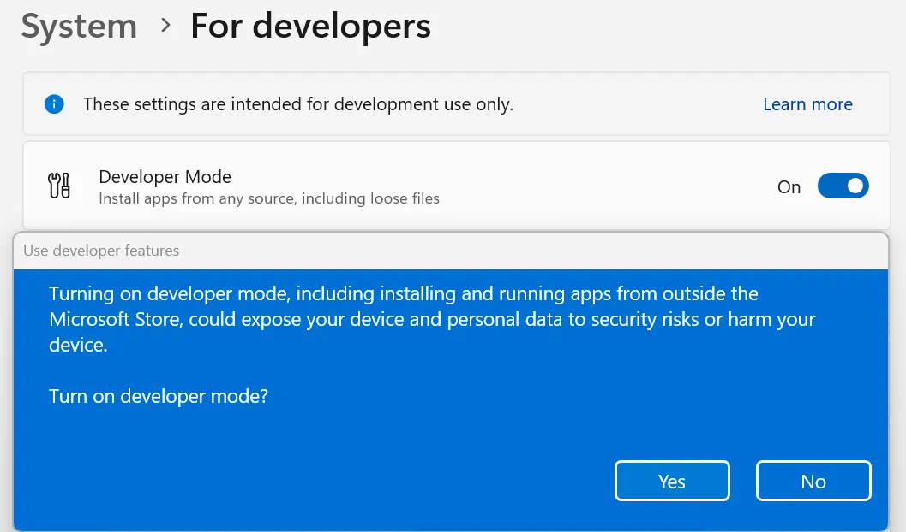
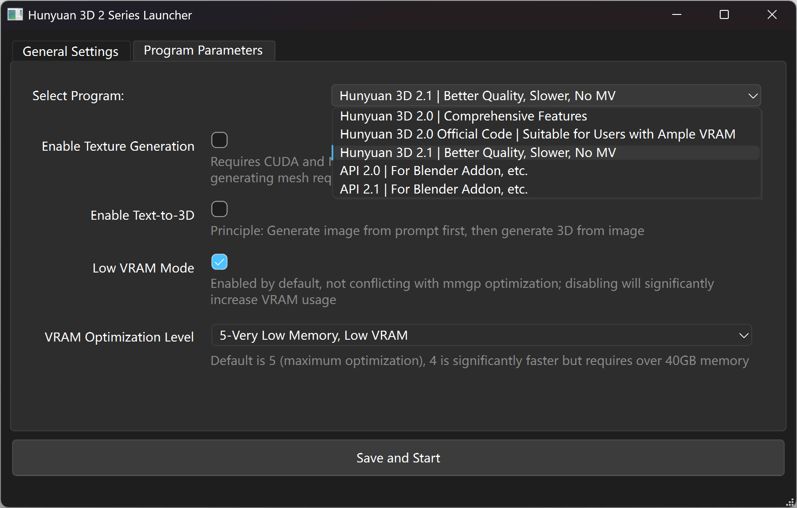

[.text-center]
English | *link:README.zh.adoc[中文说明]*

# Hunyuan3D 2.0/2.1 Windows Portable Pack

[cols="3*", frame=none, grid=none]
|===
a|image::docs/hy3d2-turbo-tex.webp[]
a|image::docs/hy3d21-shape.webp[]
a|image::docs/hy3d21-tex.webp[]
|===

A dedicated package for running
https://github.com/Tencent-Hunyuan/Hunyuan3D-2[Hunyuan3D 2.0]
and
https://github.com/Tencent-Hunyuan/Hunyuan3D-2.1[Hunyuan3D 2.1]
Gradio Web App (official demo) on Windows.

Integrated
https://github.com/deepbeepmeep/mmgp[mmgp]
from
https://github.com/deepbeepmeep/Hunyuan3D-2GP[Hunyuan3D-2GP]
made by
https://github.com/deepbeepmeep[DeepBeepMeep],
allowing the models to run on consumer-grade GPUs.

## Instructions - Preparation

### 1. Basic Requirements

** NVIDIA GPU with driver version ≥576.57 (i.e., after June 2025).
** ≥ 3 GB VRAM for geometry generation (with maximum optimization for 2.1 model)
** ≥ 6 GB VRAM for texture generation (with maximum optimization for 2.0 model)
** ≥ 24 GB System RAM (the less VRAM you have, the more RAM is needed for model offloading)

### 2. Download the Pack Based on Your GPU Architecture

[cols="1,1,1,1,1,1,1,1", options="header"]
|===
| GPU Architecture | Blackwell | Ada Lovelace | Ampere | Turing | Volta | Pascal | Maxwell

| Example GPU
| RTX 5090 | RTX 4090 | RTX 3090 | RTX 2080 | TITAN V | GTX 1080 | GTX 980

| CUDA 12.9
| ✔️ | ✔️ | ✔️ | ✔️ | ❌ | ❌ | ❌

| CUDA 12.6
| ❌ | ✔️ | ✔️ | ✔️ | ✔️ | ✔️ | ✔️
|===

__ Note: This CUDA compatibility limitation comes from
https://github.com/pytorch/pytorch/releases/tag/v2.8.0[PyTorch]
and is not related to NVIDIA CUDA Toolkit. __

* Download for CUDA 12.9:
** https://github.com/YanWenKun/Hunyuan3D-2-WinPortable/releases/download/v4-cu129/Hunyuan3D2_WinPortable_cu129.7z.001[Hunyuan3D2_WinPortable_cu129.7z.001]
** https://github.com/YanWenKun/Hunyuan3D-2-WinPortable/releases/download/v4-cu129/Hunyuan3D2_WinPortable_cu129.7z.002[Hunyuan3D2_WinPortable_cu129.7z.002]

* Download for CUDA 12.6:
** https://github.com/YanWenKun/Hunyuan3D-2-WinPortable/releases/download/v4-cu126/Hunyuan3D2_WinPortable_cu126.7z.001[Hunyuan3D2_WinPortable_cu126.7z.001]
** https://github.com/YanWenKun/Hunyuan3D-2-WinPortable/releases/download/v4-cu126/Hunyuan3D2_WinPortable_cu126.7z.002[Hunyuan3D2_WinPortable_cu126.7z.002]

* After downloading `001` and `002` files, place them in the same directory, then open and extract the `001` file.
** Extract to a shallow directory path, such as `C:\AI\HY3D2`, to avoid errors caused by long paths (exceeding the MAX_PATH limit of 260 characters).
** You do not need to open the `002` file. The extraction software will automatically handle it when decompressing the `001` file. They are two parts of a single large archive created using "split compression".
** You can use https://www.7-zip.org/[7-Zip] for extraction.

* You can also check the
https://github.com/YanWenKun/Hunyuan3D-2-WinPortable/releases[Releases page]
for other versions.

### 3. (Optional) Enable Developer Mode

Search for "Developer settings" in the Start Menu, or go to Settings -> System -> For developers, and enable "Developer Mode".

This mode enables the file system's symbolic link (symlink) feature, which prevents the Hugging Face Hub from repeatedly downloading model files and causing the model storage directory to become excessively large.

### 4. (Optional) Install Tools for Texture Generation

If you do not install the following tools, the program can still generate mesh ("shape" or "white model"), but it will not be able to generate textures.

. Install
https://developer.nvidia.com/cuda-12-9-1-download-archive?target_os=Windows&target_arch=x86_64&target_version=11&target_type=exe_network[CUDA Toolkit 12.9.1]

** During installation, you only need to select
https://github.com/YanWenKun/Comfy3D-WinPortable/raw/refs/heads/main/docs/cuda-toolkit-install-selection.webp[Libraries and Compilers].

** Other versions (e.g., 
https://developer.nvidia.com/cuda-13-0-0-download-archive[13.0]
) should theoretically work fine, and there is no need to reinstall if you already have one.

. Install Visual Studio Build Tools 2022
(
https://visualstudio.microsoft.com/visual-cpp-build-tools/[Download page]
|
https://aka.ms/vs/17/release/vs_BuildTools.exe[Installer]
)

** In the installer, select the "Desktop development with C++" workload.

## Instructions - Launcher

. Double-click `RUN.bat` to run the launcher.

. If you check "Enable Texture Generation", the necessary dependencies for this feature will be automatically compiled and installed on the first launch, which may take longer.

. Model files will be downloaded on demand when the program starts.

. After the message `running on http://0.0.0.0:8080` appears, open http://localhost:8080/ in your browser.

. You can force quit the program by closing the command line window.

## Instructions - Program Selection

. Hunyuan3D 2.0: Corresponds to the `Hunyuan3D-2` folder. Generated files are in its `gradio_cache` subdirectory.

. Hunyuan3D 2.0 Official Code: Corresponds to the `Hunyuan3D-2-vanilla` folder. Generated files are in its `gradio_cache` subdirectory.
** Does not use mmgp optimizations. It requires more VRAM but generates faster.
** Available model references:
** https://huggingface.co/tencent/Hunyuan3D-2/tree/main
** https://huggingface.co/tencent/Hunyuan3D-2mini/tree/main
** https://huggingface.co/tencent/Hunyuan3D-2mv/tree/main
** Third-party fine-tuned models should theoretically work but have not been tested.

. Hunyuan3D 2.1: Corresponds to the `Hunyuan3D-2.1` folder. Generated files are in its `save_dir` subdirectory.

. API 2.0: Corresponds to the `Hunyuan3D-2` folder, includes partial mmgp VRAM optimizations.

. API 2.1: Corresponds to the `Hunyuan3D-2.1` folder, does not include mmgp VRAM optimizations.
** Available model references:
** https://huggingface.co/tencent/Hunyuan3D-2.1/tree/main

## Usage Tips

. To view 3D files like `glb` and `obj`, you can use
https://github.com/cnr-isti-vclab/meshlab/releases[MeshLab].

. After checking "Use Turbo Model", you can still select Fast or Standard mode in the web UI to improve generation quality.

. The "Remove Background" feature uses `rembg` with its default settings, which might leave faint white edges. If your image already has a clean (alpha/transparent) background, there is no need to check this option.

. "Developer Mode" can be turned off at any time.

## Advanced Information

. The "Text-to-3D" feature uses the
https://huggingface.co/Tencent-Hunyuan/HunyuanDiT-v1.1-Diffusers-Distilled[HunyuanDiT-v1.1-Diffusers-Distilled]
text-to-image model.

. For the specific meaning of each mmgp optimization level, please refer to the
https://github.com/deepbeepmeep/mmgp#usage[mmgp documentation]
.

. For process control and batch generation, consider using
https://www.comfy.org[ComfyUI]. Refer to its
https://docs.comfy.org/tutorials/3d/hunyuan3D-2[example workflow],
and be aware of its functional limitations.

. For more advanced usage, it is recommended to write Python scripts with the help of AI and run them using this portable pack. The entire generation process has many adjustable parameters, and scripts can offer a more streamlined and flexible approach.

. This pack does not include `bpy` (Headless Blender) because the packaging CI could not install it in its environment. Its main purpose in the code is to convert 3D file formats, but its absence has not affected the software's usability.

## Related Repositories

The following code repositories were bundled in this pack:

[cols="2"]
|===
|Official 2.0 Repository
|https://github.com/Tencent-Hunyuan/Hunyuan3D-2

|2.0 with mmgp integration
|https://github.com/YanWenKun/Hunyuan3D-2

|2.1 with mmgp integration and Windows adaptation
|https://github.com/YanWenKun/Hunyuan3D-2.1

|Scripts for legacy versions
|https://github.com/YanWenKun/Hunyuan3D-2-WinPortable-Scripts

|Scripts for the latest version
|https://github.com/YanWenKun/Hunyuan3D-2-WinPortable-Scripts-GUI
|===

## Acknowledgements

* Special thanks to all the researchers, developers, and community contributors of
https://github.com/Tencent-Hunyuan/Hunyuan3D-2[Hunyuan3D 2.0]
and
https://github.com/Tencent-Hunyuan/Hunyuan3D-2.1[Hunyuan3D 2.1]

* Kudos to
https://github.com/deepbeepmeep[DeepBeepMeep]
for creating
https://github.com/deepbeepmeep/mmgp[mmgp]
and
https://github.com/deepbeepmeep/Hunyuan3D-2GP[Hunyuan3D-2GP],
bringing Hunyuan3D 2 to less-capable GPUs.

## More

Explore my other projects:

* https://github.com/YanWenKun/Comfy3D-WinPortable[Comfy3D-WinPortable] - Run ComfyUI-3D-Pack on Windows.
* https://github.com/YanWenKun/StableFast3D-WinPortable[StableFast3D-WinPortable] - Run SF3D on Windows.
* https://github.com/YanWenKun/ComfyUI-Windows-Portable[ComfyUI-Windows-Portable] - A ComfyUI bundle with 40+ custom nodes.
* https://github.com/YanWenKun/ComfyUI-WinPortable-XPU[ComfyUI-WinPortable-XPU] - A ComfyUI bundle for Intel GPUs.
* https://github.com/YanWenKun/ComfyUI-Docker[ComfyUI-Docker] - Run ComfyUI in containers.
