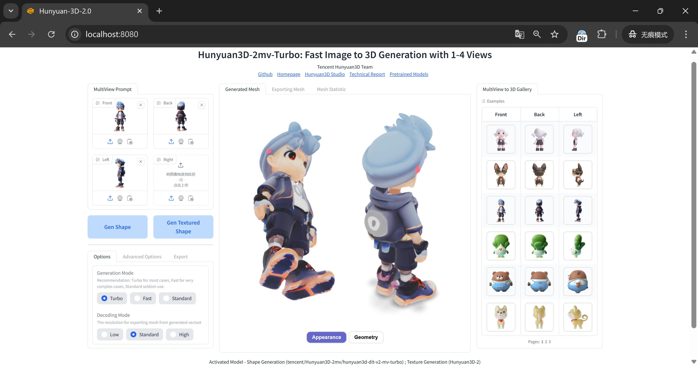

[.text-center]
English | *link:README.zh.adoc[中文说明]*

# Hunyuan3D-2 Windows Portable

A dedicated package for running
https://github.com/Tencent/Hunyuan3D-2[Hunyuan3D 2.0]
Gradio Web App (official demo) on Windows.

Integrated
https://github.com/deepbeepmeep/mmgp[mmgp]
from
https://github.com/deepbeepmeep/Hunyuan3D-2GP[Hunyuan3D-2GP]
made by
https://github.com/deepbeepmeep[DeepBeepMeep],
allowing models to run on consumer-grade GPUs.

## How to Use - Generate Shape Only

image::docs/sc-white-mesh.webp["Screenshot"]

This approach creates a 3D mesh (untextured) from a single image, featuring straightforward steps and no extra software dependencies. Beginners please complete this step first before moving on to more advanced usage.

. Requirements:
** NVIDIA GPU with at least 6GB of VRAM (4GB may work but will be very slow). 
** GPU driver version must be newer than January 2025 (version >570).

. Download
https://github.com/YanWenKun/Hunyuan3D-2-WinPortable/releases/download/v3.3/Hunyuan3D2_WinPortable.7z.001[Hunyuan3D2_WinPortable.7z.001],
https://github.com/YanWenKun/Hunyuan3D-2-WinPortable/releases/download/v3.3/Hunyuan3D2_WinPortable.7z.002[Hunyuan3D2_WinPortable.7z.002]
and extract.
** Make sure to download both files, they are one package split into two parts.
** To extract, open the `001` file with
https://www.7-zip.org/[7-Zip] or similar software,
and extract it to a convenient location. You don't need to open the `002` file again.

. If you are using a GPU with older architecture like Volta (TITAN V), Pascal (GTX 1080), or Maxwell (GTX 980),
download the compatible version instead of the files above:
https://github.com/YanWenKun/Hunyuan3D-2-WinPortable/releases/download/v2/Hunyuan3D2_WinPortable.7z[Hunyuan3D2_WinPortable.7z (compatible cu124)]

** Or check for other versions at
https://github.com/YanWenKun/Hunyuan3D-2-WinPortable/releases[releases page].

. Run `0-initialize.bat` and wait. If updates fail, simply rerun to continue.

. Run `2-download-models.bat` and wait for the download to complete (~19GB).

. Run `3-start.bat`, ignore error messages about `EP Error`. Wait for the info message:

 Uvicorn running on http://0.0.0.0:8080 (Press CTRL+C to quit)

. Open http://localhost:8080/ in your browser. Enjoy!

. Output files will be saved in `Hunyuan3D-2\gradio_cache`.

. You can close the command window to stop the program.

Other options:

* If your GPU has less than 6GB VRAM, use `run-very_low_vram.bat`.

* If your GPU has 24GB+ VRAM, run `run-high_vram.bat` for better performance.

##  How to Use - Generate Shape and Texture

image::docs/sc-textured-mesh.webp["Screenshot"]

This approach generates both mesh and textures, requiring more VRAM and additional installation steps.

[NOTE]
====
Please complete all steps from the previous section _How to Use - Generate Shape Only_ first, 
then exit the program before proceeding with the following steps.
====


. Requirements:
** NVIDIA GPU with at least 8GB of VRAM (6GB may work but will be very slow). 
** Minimum 24GB of system RAM.

. Install 
https://developer.nvidia.com/cuda-12-9-1-download-archive?target_os=Windows&target_arch=x86_64&target_version=11&target_type=exe_network[CUDA Toolkit 12.9.1].

** Only
https://github.com/YanWenKun/Comfy3D-WinPortable/raw/refs/heads/main/docs/cuda-toolkit-install-selection.webp[Libraries and Compilers]
are needed to install.

** Other versions ( 
https://developer.nvidia.com/cuda-12-8-1-download-archive[12.8]
) should work as well. You don't need to install additional if you already have one.

. Install Visual Studio Build Tools 2022
(
https://visualstudio.microsoft.com/visual-cpp-build-tools/[Page]
|
https://aka.ms/vs/17/release/vs_BuildTools.exe[EXE]
).

** During setup, select the "Desktop development with C++" workload.

. Run `1-compile-install-texture-gen.bat`, wait for the installation to finish.

. Run `3-start.bat`. When ready, the following message will appear:

 Uvicorn running on http://0.0.0.0:8080 (Press CTRL+C to quit)

** If you see `EP Error: Can't load TensorRT`, the app will automatically fallback to CUDA. This error can be safely ignored.

. Open http://localhost:8080/ in your browser.

. Output files will be saved in `Hunyuan3D-2\gradio_cache` as well.

Other options:

* Use `run-very_low_vram.bat` if your GPU has less than 8GB VRAM.

* Use `run-high_vram.bat` if your GPU has 24GB+ VRAM.

## How to use - Multi View to 3D



This method generates 3D models with textures using 1 to 4 fixed viewpoint images. The official example uses front-back-left views, while users may optionally add the right view for four-viewpoint model generation.

The process offers two working modes:

1. "Gen Shape" (generates untextured mesh)

2. "Gen Textured Shape"

** Note: The texture generation feature requires the same setup steps described in the previous section "How to Use - Generate Shape and Texture".

If you've successfully run texture generation in the previous step, simply:

1. Exit the program

2. Run `4-start-mv.bat`

Additional options:

* For GPUs with ≥24GB VRAM: Use `run-mv-high_vram.bat` for better performance.

## How to use - API Server

This method launches a local server to enable API access for external applications (e.g. Blender) to utilize the model's capabilities.

* Same setup procedure as described in "How to Use - Generate Shape and Texture".

* Run `5-start-api-server.bat` and wait for loading.

** (Optional) To change ports: Modify the `--port 8081` parameter in the file.

## How to use - Text to 3D

image::docs/sc-text-to-3d.webp["Screenshot"]

The Text to 3D feature combines:
(1) Text to Image
(2) Image to 3D.
For an experienced user, it might not be worth downloading another Text-to-Image model. Therefore, this feature is disabled by default. However, you can easily enable it:

* After the `2-download-models.bat` script completes, run `run-with-text_to_3d.bat`. 
This will download the required models (~13.4GB) and start the app. 
If the download fails, simply re-run the script.

* Texture Generation feature is optional for Text-to-3D. You can always get a white mesh without installing texgen.

By the way, the HunyuanDiT model works great for this purpose.

## Tips

. The "Remove Background" feature uses `rembg` with default settings, which may leave faint white edges. Turn it off if your images already have clean alpha channels.

. The VRAM optimization in this package came from 
https://github.com/deepbeepmeep[DeepBeepMeep]'s 
https://github.com/deepbeepmeep/Hunyuan3D-2GP[Hunyuan3D-2GP] project.
For VRAM/RAM requirements of different profile levels, see the 
https://github.com/deepbeepmeep/mmgp#usage[mmgp documentation].

** Very-low VRAM mode: `--profile 5`
** Default mode: `--profile 4` 
** High VRAM mode: `--profile 1` (requires 48GB RAM + 24GB VRAM)

. To update:

** Run `UPDATE.bat`.
** Note: This package uses a
https://github.com/YanWenKun/Hunyuan3D-2[customized fork] of Hunyuan3D 2.0, and a 
https://github.com/YanWenKun/Hunyuan3D-2-WinPortable-Scripts[scripts repo],
both maintained by me, which might not always be up-to-date.

. Need to set a proxy for Internet access?

** Add the following lines on top to any script you run into issues with, adjusting for your proxy server:

```
set HTTP_PROXY=http://localhost:1080
set HTTPS_PROXY=http://localhost:1080

```


## Thanks

* Special thanks to the researchers, developers, and all contributors of
https://github.com/Tencent/Hunyuan3D-2[Hunyuan3D 2.0].

* Kudos to
https://github.com/deepbeepmeep[DeepBeepMeep]
for creating
https://github.com/deepbeepmeep/mmgp[mmgp]
and
https://github.com/deepbeepmeep/Hunyuan3D-2GP[Hunyuan3D-2GP],
bringing Hunyuan3D 2.0 to less-capable GPUs.

## More

Explore my other projects:

* https://github.com/YanWenKun/Comfy3D-WinPortable[Comfy3D-WinPortable] - Run ComfyUI-3D-Pack on Windows.
* https://github.com/YanWenKun/StableFast3D-WinPortable[StableFast3D-WinPortable] - Run SF3D on Windows.
* https://github.com/YanWenKun/ComfyUI-Windows-Portable[ComfyUI-Windows-Portable] - A ComfyUI bundle with 40+ custom nodes.
* https://github.com/YanWenKun/ComfyUI-WinPortable-XPU[ComfyUI-WinPortable-XPU] - A ComfyUI bundle for Intel GPUs.
* https://github.com/YanWenKun/ComfyUI-Docker[ComfyUI-Docker] - Run ComfyUI in containers.
