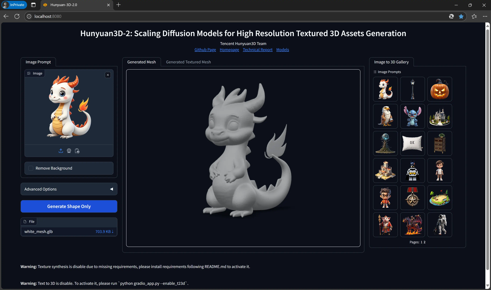
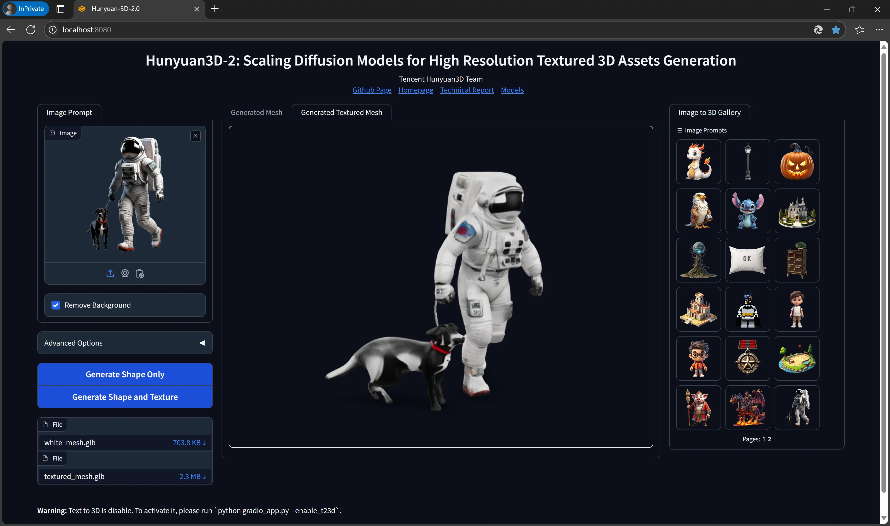
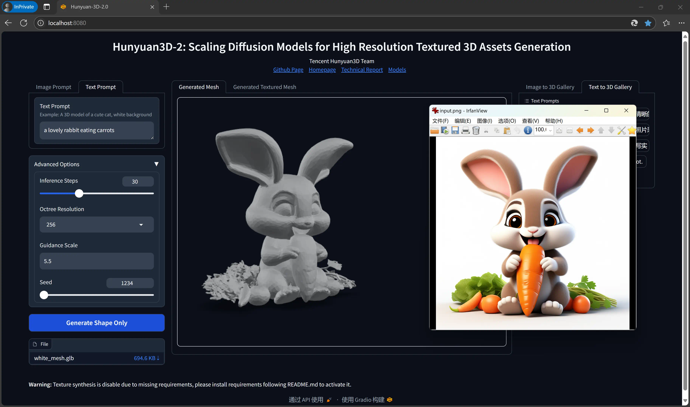

# 混元 3D 2.0 Windows 整合包

[.text-center]
中文 | link:README.adoc[English]

用于在 Windows 上运行 
https://github.com/Tencent/Hunyuan3D-2[混元 3D 2.0]
官方 demo (Gradio App) 的整合包。

## 使用方法 - 仅生成几何



该方法较为简单，无需额外安装软件。
用户输入一张图片，得到三维模型（白模）。

. 基本需求：

** NVIDIA GPU，最少 6GB 显存（4GB 也许能用，但会很慢）；
** 显卡驱动版本不低于 550 （即 2024 年 3 月后）。

. 下载
https://github.com/YanWenKun/Hunyuan3D-2-WinPortable/releases/download/v1/Hunyuan3D2_WinPortable.7z[Hunyuan3D2_WinPortable.7z]
并解压到一个方便的地方（最好目录不要太深）。

. 把 `中文脚本` 目录下的文件复制到上一级目录（即 `Hunyuan3D2_WinPortable`）下。

. 运行 `2-下载模型.bat`，等待下载完成（约 26GB）。如果下载失败，重新运行该脚本可继续。

. 运行 `3-run_cn.bat`，忽略报错信息，等待启动完成的信息：

 Uvicorn running on http://0.0.0.0:8080 (Press CTRL+C to quit)

. 浏览器打开 http://localhost:8080/ ，开始生成！

. 输出的图片、网格文件保存在 `Hunyuan3D-2\gradio_cache` 目录下。

其他选项：

* 如果你的显存不足 6GB，运行 `运行_超低显存模式.bat`。

## 使用方法 - 生成几何与纹理



该方法需要一些额外步骤。

. 基本需求：

** NVIDIA GPU，最少 8GB 显存（6GB 也许能用，但会很慢）；
** 显卡驱动版本不低于 550 （即 2024 年 3 月后）；
** 系统内存不低于 24GB。

. 安装
https://developer.nvidia.com/cuda-12-4-1-download-archive?target_os=Windows&target_arch=x86_64&target_version=11&target_type=exe_network[CUDA Toolkit 12.4.1]

** 安装时仅需要选择
https://github.com/YanWenKun/Comfy3D-WinPortable/raw/refs/heads/main/docs/cuda-toolkit-install-selection.webp[Libraries 与 Compilers]

. 安装 Visual Studio Build Tools 2022
（
https://visualstudio.microsoft.com/visual-cpp-build-tools/[下载页面]
|
https://aka.ms/vs/17/release/vs_BuildTools.exe[安装程序]
）

** 在安装界面选择“桌面C++开发”。

. 下载
https://github.com/YanWenKun/Hunyuan3D-2-WinPortable/releases/download/v1/Hunyuan3D2_WinPortable.7z[Hunyuan3D2_WinPortable.7z]
并解压。也可在
https://github.com/YanWenKun/Hunyuan3D-2-WinPortable/releases[发布页]
查看是否有更新。

. 把 `中文脚本` 目录下的文件复制到上一级目录（即 `Hunyuan3D2_WinPortable`）下。

. 运行 `更新.bat`，确保执行的是最新代码。

. 运行 `1-编译安装纹理生成功能.bat`，等待编译安装完成。

. 运行 `2-下载模型.bat`，等待下载完成（约 26GB）。如果下载失败，重新运行该脚本可继续。

. 运行 `3-run_cn.bat`，待启动完成：

 Uvicorn running on http://0.0.0.0:8080 (Press CTRL+C to quit)

** 对于 20 系之前的显卡，会提示 `EP Error: Can't load TensorRT`，忽略即可，程序找不到 Tensor 执行会自动改用 CUDA 执行。

. 浏览器打开 http://localhost:8080/

. 输出的文件保存在 `Hunyuan3D-2\gradio_cache` 目录下。

其他选项：

* 如果你的显存不足 8GB，运行 `运行_超低显存模式.bat`。

## 使用方法 - 文本转 3D



文生 3D 的原理是先文生图，再图生 3D。对于有经验的用户而言，可能没有必要再下载一个文生图模型，因此默认不启用该功能。

但 HunyuanDiT 文生图生 3D 组合效果其实很不错，而且支持中文输入。

首先运行 `2-下载模型.bat`，再运行 `运行_带文生3D.bat` 即可启动。

该脚本会额外下载约 13.4GB 的模型，如果下载失败（文件损坏也会使程序加载失败），重新运行该脚本即可。

文生 3D 功能与纹理生成功能互相独立，不安装后者也能正常使用。

## 技巧

. 移除背景（Remove Background）功能使用的是 `rembg` （默认配置），可能会生成轻微白边。如果你的图片本身已经抠干净背景了，就没必要勾选这个功能了。

. 我有 24GB 显存！多用点！

** 编辑 `运行_超低显存模式.bat`，把 `--profile 5` 替换为 `--profile 1`，即 48GB 内存 + 24GB 显存模式。
** 这背后的显存优化来自于
https://github.com/deepbeepmeep[DeepBeepMeep]
所创建的
https://github.com/deepbeepmeep/Hunyuan3D-2GP[Hunyuan3D-2GP]。
** 关于不同等级的 profile 所需显存／内存，参考
https://github.com/deepbeepmeep/mmgp#usage[mmgp 文档]。

. 如何更新：

** 运行 `更新.bat`。
** 这个脚本只是执行 `git reset --hard` 和 `git pull`，从代码仓库拉取更新。
** 代码仓库并非使用混元 3Dv2 的官方仓库，而是我维护的一个
https://github.com/YanWenKun/Hunyuan3D-2[专门分支]
，个人精力有限，可能无法第一时间同步官方更新，但会保证先测再发。

. 配置代理：

** `中文脚本` 均使用国内镜像（PyPI、HuggingFace、GitHub），理论上无需代理。
** 如遇到镜像失效的情况，建议先尝试用英文脚本运行，看能否直连，如不行，再在脚本开头添加代理配置：

```
set HTTP_PROXY=http://localhost:1080
set HTTPS_PROXY=http://localhost:1080

```


## 感谢

* 特别感谢
https://github.com/Tencent/Hunyuan3D-2[混元 3D 2.0]
的所有研究者、开发者和社区贡献者

* 特别感谢
https://github.com/deepbeepmeep[DeepBeepMeep]
创建的
https://github.com/deepbeepmeep/mmgp[mmgp]
以及
https://github.com/deepbeepmeep/Hunyuan3D-2GP[Hunyuan3D-2GP]，
为低显存用户带来了可能。

## 顺便一提

我的相关项目：

* https://github.com/YanWenKun/Comfy3D-WinPortable[Comfy3D-WinPortable] - ComfyUI-3D-Pack 的 Windows 整合包
* https://github.com/YanWenKun/StableFast3D-WinPortable[StableFast3D-WinPortable] - SF3D 的 Windows 整合包
* https://github.com/YanWenKun/ComfyUI-Windows-Portable[ComfyUI-Windows-Portable] - 预装了 40+ 扩展的 ComfyUI Windows 整合包
* https://github.com/YanWenKun/ComfyUI-Docker[ComfyUI-Docker] - 运行 ComfyUI 的容器镜像
