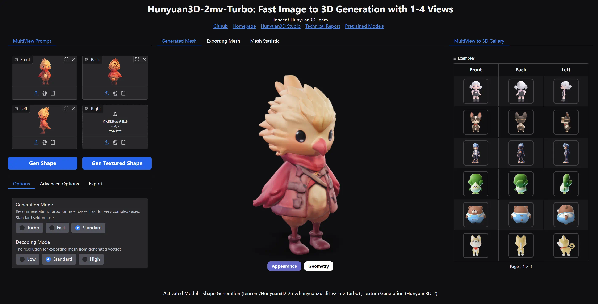

# 混元 3D 2.0/2.1 Windows 整合包

[cols="3*", frame=none, grid=none]
|===
a|image::docs/hy3d2-turbo-tex.webp[]
a|image::docs/hy3d21-shape.webp[]
a|image::docs/hy3d21-tex.webp[]
|===

[.text-center]
中文 | link:README.adoc[English]

用于在 Windows 上运行 
https://github.com/Tencent-Hunyuan/Hunyuan3D-2[混元 3D 2.0]
以及
https://github.com/Tencent-Hunyuan/Hunyuan3D-2.1[混元 3D 2.1]
官方 demo (Gradio App) 的整合包。

整合了
https://github.com/deepbeepmeep[DeepBeepMeep]
创建的
https://github.com/deepbeepmeep/mmgp[mmgp]
以及
https://github.com/deepbeepmeep/Hunyuan3D-2GP[Hunyuan3D-2GP]，
使得模型可以在显存有限的消费级显卡上运行。

## 使用说明 - 准备工作

### 1. 基本需求

** NVIDIA GPU，驱动版本 ≥576.57（即 2025 年 6 月后）。
** 生成几何需 ≥ 3 GB 显存（2.1 模型最大优化）
** 生成纹理需 ≥ 6 GB 显存（2.0 模型最大优化）
** 系统内存需 ≥ 24 GB（显存越小，需要的内存越大，以供模型卸载）

### 2. 根据 GPU 架构下载整合包

[cols="1,1,1,1,1,1,1,1", options="header"]
|===
| GPU 架构 | Blackwell | Ada Lovelace | Ampere | Turing | Volta | Pascal | Maxwell

| 示例 GPU
| RTX 5090 | RTX 4090 | RTX 3090 | RTX 2080 | TITAN V | GTX 1080 | GTX 980

| CUDA 12.9
| ✔️ | ✔️ | ✔️ | ✔️ | ❌ | ❌ | ❌

| CUDA 12.6
| ❌ | ✔️ | ✔️ | ✔️ | ✔️ | ✔️ | ✔️
|===

__ 注：这里的 CUDA 兼容性限制来自
https://github.com/pytorch/pytorch/releases/tag/v2.8.0[PyTorch]
，与 NVIDIA 无关。 __

* CUDA 12.9 版本下载：
** https://github.com/YanWenKun/Hunyuan3D-2-WinPortable/releases/download/v4-cu129/Hunyuan3D2_WinPortable_cu129.7z.001[Hunyuan3D2_WinPortable_cu129.7z.001]
** https://github.com/YanWenKun/Hunyuan3D-2-WinPortable/releases/download/v4-cu129/Hunyuan3D2_WinPortable_cu129.7z.002[Hunyuan3D2_WinPortable_cu129.7z.002]

* CUDA 12.6 版本下载：
** https://github.com/YanWenKun/Hunyuan3D-2-WinPortable/releases/download/v4-cu126/Hunyuan3D2_WinPortable_cu126.7z.001[Hunyuan3D2_WinPortable_cu126.7z.001]
** https://github.com/YanWenKun/Hunyuan3D-2-WinPortable/releases/download/v4-cu126/Hunyuan3D2_WinPortable_cu126.7z.002[Hunyuan3D2_WinPortable_cu126.7z.002]

* 将两个文件下载完成后，放在同一目录下，打开 `001` 并解压即可。
** 解压路径最好是纯英文/数字，且无空格。
** 解压路径尽量浅，比如 `C:\AI\HY3D2`，以免路径过长（触发 MAX_PATH 260）导致报错。
** 无需再打开 `002` 文件，解压软件在解压 `001` 时已自动处理。它们是一个大压缩包“分卷压缩”成了两个文件。
** 解压软件可使用 https://www.7-zip.org/[7-Zip] 。

* 也可在
https://github.com/YanWenKun/Hunyuan3D-2-WinPortable/releases[发布页]
查看其他版本。

### 3. 启用开发人员模式

在开始菜单中搜索“开发人员模式”，或进入设置-系统-开发者选项，启用“开发人员模式”。

该模式会启用文件系统的符号链接（symlink）功能，避免 HuggingFace Hub 重复下载模型文件，导致模型存储目录过大。

### 4. （可选）安装纹理生成所需工具

如果不安装下列工具，程序仍然可以生成几何（白模），只是无法生成纹理。

. 安装
https://developer.nvidia.com/cuda-12-9-1-download-archive?target_os=Windows&target_arch=x86_64&target_version=11&target_type=exe_network[CUDA Toolkit 12.9.1]

** 安装时仅需要选择
https://github.com/YanWenKun/Comfy3D-WinPortable/raw/refs/heads/main/docs/cuda-toolkit-install-selection.webp[Libraries 与 Compilers]

** 其他版本（ 
https://developer.nvidia.com/cuda-13-0-0-download-archive[13.0]
）理论上可正常工作，无需重复安装。

. 安装 Visual Studio Build Tools 2022
（
https://visualstudio.microsoft.com/visual-cpp-build-tools/[下载页面]
|
https://aka.ms/vs/17/release/vs_BuildTools.exe[安装程序]
）

** 在安装界面选择“桌面C++开发”。

## 使用说明 - 启动器

. 建议先运行 `更新.bat`。

. 双击 `启动.bat` 即可运行启动器。

. 如果勾选了“启用纹理生成功能”，在启动时会自动编译安装功能所需的依赖，因而第一次启动会较慢。

. 模型文件会在程序启动时按需下载。

. 等待启动完成的信息 `running on http://0.0.0.0:8080` 出现后，浏览器打开 http://localhost:8080/ 即可。

. 关闭命令行窗口可强制退出程序。

## 使用说明 - 程序选择

. 混元 3D 2.0：对应 `Hunyuan3D-2` 文件夹，生成的文件在其 `gradio_cache` 下。

. 混元 3D 2.0 官方代码：对应 `Hunyuan3D-2-vanilla` 文件夹，生成的文件在其 `gradio_cache` 下。
** 未使用 mmgp 优化，显存需求较高，但生成的速度也较快。
** 可选模型参考：
** https://huggingface.co/tencent/Hunyuan3D-2/tree/main
** https://huggingface.co/tencent/Hunyuan3D-2mini/tree/main
** https://huggingface.co/tencent/Hunyuan3D-2mv/tree/main
** 理论上第三方微调后的模型也能用，但未测试。

. 混元 3D 2.1：对应 `Hunyuan3D-2.1` 文件夹，生成的文件在其 `save_dir` 下。

. API 2.0：对应 `Hunyuan3D-2` 文件夹，含部分 mmgp 显存优化。

. API 2.1：对应 `Hunyuan3D-2.1` 文件夹，不含 mmgp 显存优化。
** 可选模型参考：
** https://huggingface.co/tencent/Hunyuan3D-2.1/tree/main

## 使用技巧

. 查看 glb, obj 等 3D 文件可使用
https://github.com/cnr-isti-vclab/meshlab/releases[MeshLab]
。

. 勾选“使用 Turbo 模型”后，依然可以在网页选用 Fast 或 Standard 模式以提高生成质量。

. 移除背景（Remove Background）功能使用的是 `rembg` 且使用默认的抠图模型，可能会生成轻微白边。如果你的图片本身已经抠干净背景了，就没必要勾选这个功能了。

. “开发人员模式”可随时关闭。

## 进阶说明

. “文生 3D”功能使用的文生图模型为
https://huggingface.co/Tencent-Hunyuan/HunyuanDiT-v1.1-Diffusers-Distilled[HunyuanDiT-v1.1-Diffusers-Distilled]
。

. mmgp 各优化等级的具体含义可以参考
https://github.com/deepbeepmeep/mmgp#usage[mmgp 文档]
。

. 过程控制/批量生成可以考虑使用
https://www.comfy.org[ComfyUI]
，参考其
https://docs.comfy.org/tutorials/3d/hunyuan3D-2[样例工作流]
，注意其功能限制。

. 更进阶的使用，建议通过 AI 编写 Python 脚本，利用本整合包运行。整个生成流程可调整的参数很多，脚本可以做到更精简、更灵活。

. 因打包 CI 无法在其环境内安装，本整合包未包含 `bpy` （Headless Blender）。其在代码中主要用于转换 3D 文件格式，但缺失后并未影响软件使用。

## 相关仓库

本整合包在构建时打包了以下仓库，在此列出以便开发者查找：

[cols="2"]
|===
|官方 2.0 仓库
|https://github.com/Tencent-Hunyuan/Hunyuan3D-2

|整合了 mmgp 的 2.0
|https://github.com/YanWenKun/Hunyuan3D-2

|整合了 mmgp 并适配 Windows 的 2.1
|https://github.com/YanWenKun/Hunyuan3D-2.1

|旧版本使用的运行脚本
|https://github.com/YanWenKun/Hunyuan3D-2-WinPortable-Scripts

|新版本使用的运行脚本
|https://github.com/YanWenKun/Hunyuan3D-2-WinPortable-Scripts-GUI
|===

## 感谢

* 特别感谢
https://github.com/Tencent-Hunyuan/Hunyuan3D-2[混元 3D 2.0]
和
https://github.com/Tencent-Hunyuan/Hunyuan3D-2.1[混元 3D 2.1]
的所有研究者、开发者和社区贡献者

* 特别感谢
https://github.com/deepbeepmeep[DeepBeepMeep]
创建的
https://github.com/deepbeepmeep/mmgp[mmgp]
以及
https://github.com/deepbeepmeep/Hunyuan3D-2GP[Hunyuan3D-2GP]，
为低显存用户带来了可能。

* 特别感谢国内镜像站点提供的下载服务：
** https://hf-mirror.com
** https://mirrors.cernet.edu.cn
** https://gh-proxy.com
** https://ghfast.top

## 顺带一提

我的相关项目：

* https://github.com/YanWenKun/Comfy3D-WinPortable[Comfy3D-WinPortable] - ComfyUI-3D-Pack 的 Windows 整合包
* https://github.com/YanWenKun/StableFast3D-WinPortable[StableFast3D-WinPortable] - SF3D 的 Windows 整合包
* https://github.com/YanWenKun/ComfyUI-Windows-Portable[ComfyUI-Windows-Portable] - 预装了 40+ 扩展的 ComfyUI Windows 整合包
* https://github.com/YanWenKun/ComfyUI-WinPortable-XPU[ComfyUI-WinPortable-XPU] - 适配 Intel GPU 的 ComfyUI Windows 整合包
* https://github.com/YanWenKun/ComfyUI-Docker[ComfyUI-Docker] - 运行 ComfyUI 的容器镜像
